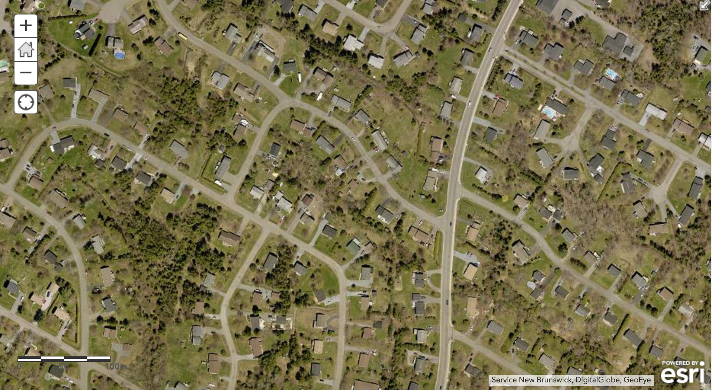
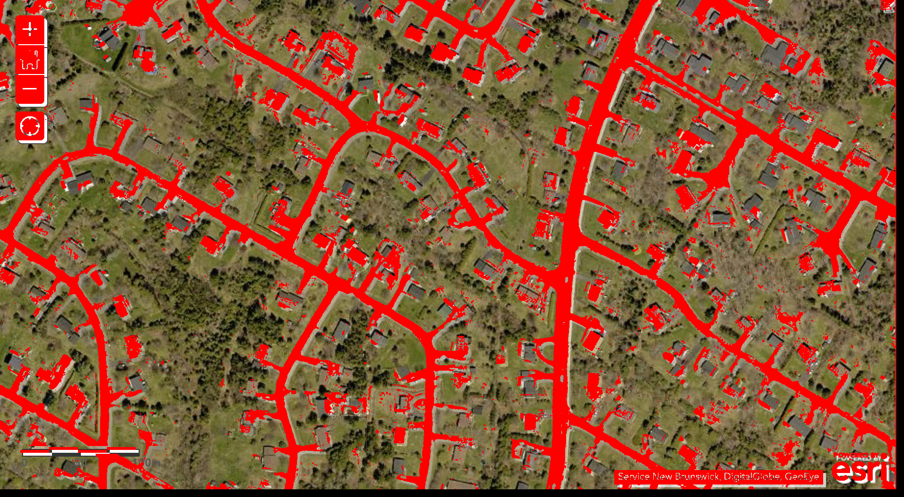

# Road-Finder
A program that analyzes satellite pictures to classify road
Uses a K-nearest neighbor algorithm to look at a pixel grid from satelitte images and highlights them if there is a match
Satellite Images from ArcGis
Algorithm From Scikit Learn

Before

After

Before 2

After 2

