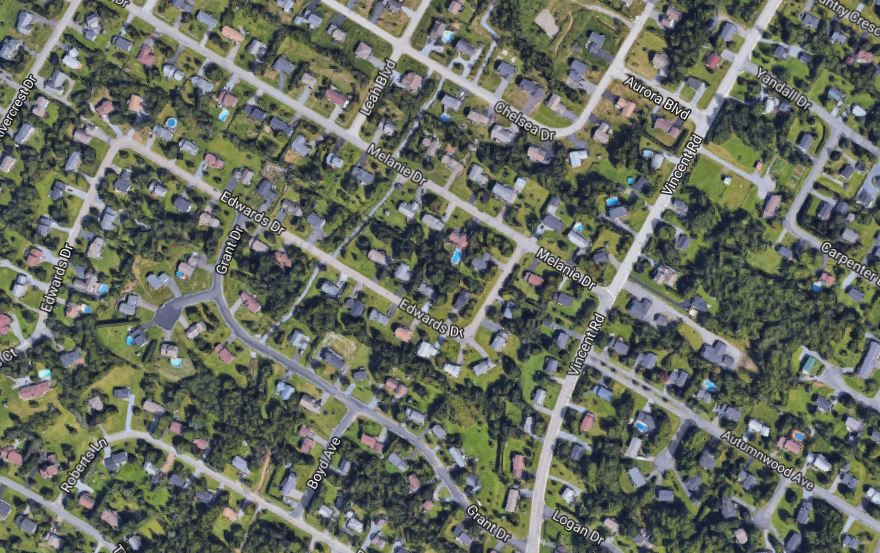
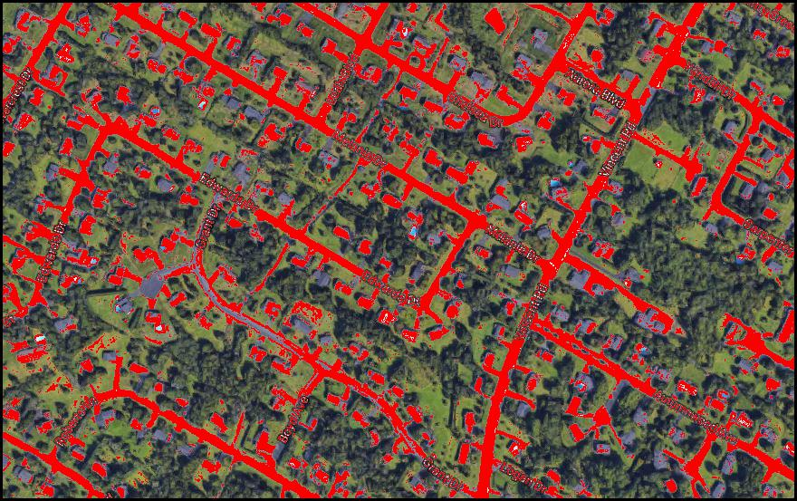

# Road-Finder
A program that analyzes satellite pictures to classify roads and houses

Uses a classification algorithm to look at pixel data from satelitte images and highlights them if there is a match

Before

After

